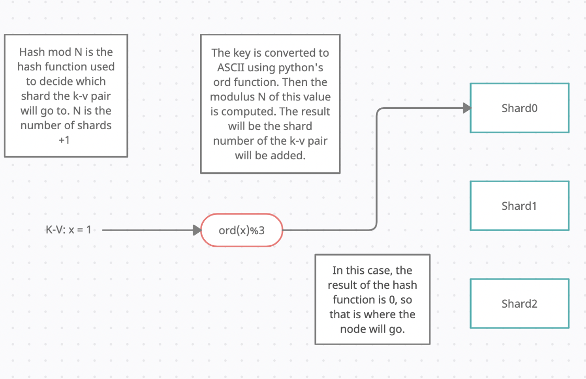

# Distributed-Key-Value-Store

Built a REST API with Flask to create a, sharded, replicated, Fault-Tolerant Key-Value Store. Causal Consistency was enforced through Vector Clocks, so each message will be delivered in the correct order.
Docker instances were used as virtual nodes that communicate over a docker network.
Implemented Fault-Tolerance with sharding, so if one node crashes, information is still preserved on another node. In this case, the Key-Value Store redistributes data among the remaining machines and reshards. Shards had at least two nodes.
Distributed Keys with Consistent hashing; a hash function is used to split key-values received between shards.
Supports view operations, sharded operations, and key-value operations.

Note: if there are <= 3 nodes running, there will only be one shard

## Hash Function

## Consistent Hashing with Shards

## Node Crash Example

## Vector Clocks for Causal Consistency

## Causal Anomaly

